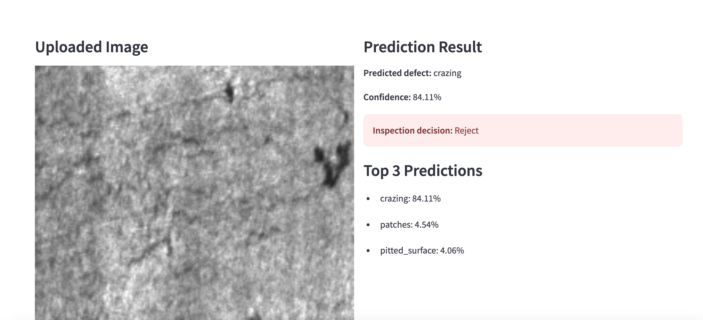

# Surface Defect Inspector (Industrial AI Demo)

This project demonstrates a simple industrial computer vision workflow for automated surface defect classification.

## Project Motivation
In manufacturing environments such as turbine blade production or steel processing, visual inspection is critical for quality control. This project simulates an AI-based inspection system that can assist operators in detecting defects from surface images.

## Features
- Industrial dataset preprocessing pipeline
- Image classification model using PyTorch
- Transfer learning based CNN architecture
- Model inference pipeline
- Streamlit web application for real-time prediction
- Simple inspection decision logic (Reject / Review / Accept)

## Dataset
NEU Surface Defect Dataset (6 defect classes)

## How to Run

Train model:
python train.py

Run demo app:
streamlit run app.py

## Demo Screenshot

## Future Improvements
- Add defect localization (object detection)
- Improve model accuracy with pretrained weights
- Deploy to cloud platform
- Integrate camera input simulation